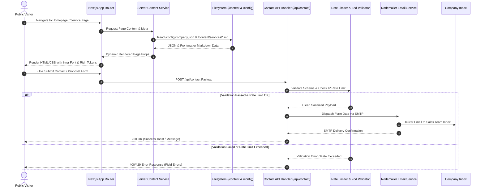
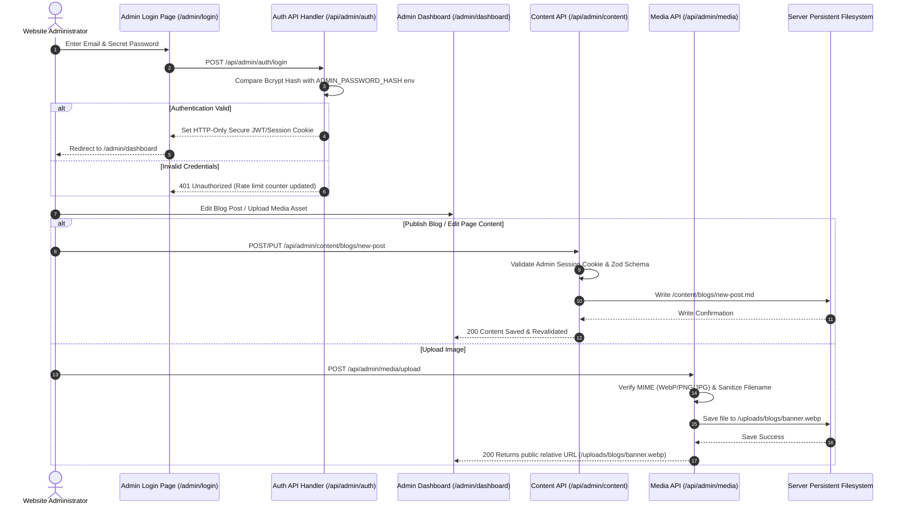

# Comprehensive System Design & User Journey Specification

This document provides the complete **System Design**, **User Journey Diagrams**, and **File Responsibility & Code Mapping Matrix** derived from analyzing all 9 system specification files (`09-01-Architecture-and-Planning.md` through `09-09-Deployment-Operations-and-Maintenance.md`).

---

## 1. System Architecture Overview

The system is a **database-free, file-driven enterprise website and content management system** built with Next.js (App Router), TypeScript, and Tailwind CSS. All website content, company configuration, global SEO metadata, and admin-uploaded media are stored strictly in persistent server-side files (`/content`, `/config`, `/uploads`). Public contact enquiries and form submissions are handled strictly via validated transactional emails without persisting user records to any database.

### System Architecture Diagram

```mermaid
graph TD
    subgraph Client Layer
        V[Public Visitor Browser]
        A[Admin Browser]
    end

    subgraph Next.js Application Server
        subgraph Routing & Layout
            PR[Public App Router Routes\n/app/(public)]
            AR[Protected Admin Routes\n/app/admin]
            API[API Route Handlers\n/app/api]
        end

        subgraph Server Services Layer (/server)
            AUTH[Auth Service\n/server/auth]
            CS[Content Service\n/server/content]
            MS[Media Service\n/server/media]
            SS[Settings Service\n/server/settings]
            ES[Email Service\n/server/email]
            SEOS[SEO Service\n/server/seo]
            SEC[Security & Validation\n/server/security & /server/validation]
        end

        subgraph File Storage System (Database-Free)
            CFG[Config Files\n/config/*.json]
            CNT[Content Files\n/content/*/*.md]
            UPL[Media Uploads\n/uploads/*]
        end
    end

    subgraph External Systems
        SMTP[Transactional SMTP Provider]
        INBOX[Company Sales Email Inbox]
    end

    %% Visitor Flow
    V -->|HTTPS GET Page| PR
    V -->|Submit Contact Form| API
    PR --> CS
    PR --> SS
    PR --> SEOS
    CS --> CNT
    SS --> CFG
    SEOS --> CFG

    API -->|Validate Zod & Rate Limit| SEC
    SEC --> ES
    ES -->|Nodemailer / SMTP| SMTP
    SMTP --> INBOX

    %% Admin Flow
    A -->|Login Credentials| API
    API -->|Set HTTP-Only Cookie| AUTH
    A -->|Authenticated Session| AR
    AR --> CS
    AR --> MS
    AR --> SS
    MS --> UPL
```

---

## 2. Comprehensive User Journey Diagrams

### Journey 1: Public Visitor (Discovery, Exploration & Lead Submission)



### Journey 2: Admin Content & Asset Management (Database-Free CMS Flow)



---

## 3. Markdown Specification Files Mapping & Code Responsibility Matrix

Below is the file-by-file breakdown of what is written in each of the 9 markdown specification files in the workspace, what responsibilities they dictate, and what application code modules implement them.

| Specification File | Primary Purpose & Specification Summary | Key Code Responsibility ("What File Responsible For What") | Implementation Code Files Mapped |
| :--- | :--- | :--- | :--- |
| **`09-01-Architecture-and-Planning.md`** | Core high-level architecture: Database-free rule, storage philosophy (`/content`, `/config`, `/uploads`), email-only contact processing, admin cookie authentication, persistent hosting constraints. | **Core System Architecture**: Defines global storage constraints, forbids databases (No Prisma/Postgres/Mongo), enforces strict server file separation, and defines contact/admin top-level boundaries. | `next.config.js`<br>`tsconfig.json`<br>`package.json`<br>`middleware.ts` |
| **`09-02_Design_System.md`** | Enterprise Design System: Color tokens, Inter typography, 12-column 1440px grid, responsive breakpoints, design rules (subtle motion, no flashy visual noise, accessible contrast). | **Visual Styling & UI Tokens**: Establishes global CSS design tokens, button variants, card layouts, form inputs, border radiuses, shadows, and light/dark theme rules. | `app/globals.css`<br>`tailwind.config.ts`<br>`components/ui/*`<br>`lib/theme.ts` |
| **`09-03_Page_Specifications.md`** | Specifications for all static & dynamic public pages: Home, About, Services, Solutions, Industries, Portfolio, Case Studies, Blog, Pricing, FAQ, Careers, Contact, Legal, Search, 404, 500. | **Page Routing & Section Structure**: Defines exact section hierarchy, mandatory CTAs, meta data placement, and content blocks for every single website page route. | `app/(public)/**/page.tsx`<br>`app/not-found.tsx`<br>`app/error.tsx` |
| **`09-04_Component_System.md`** | Complete component library structure: UI base elements, Layout wrappers, Navbars, Hero variants, Cards, Forms, Blog components, CMS controls, Dashboard widgets. | **Reusable UI Components**: Defines atomic UI components, layout structures, card representations, interactive forms with Zod validation, and Framer Motion micro-animations. | `components/ui/*`<br>`components/cards/*`<br>`components/sections/*`<br>`components/forms/*`<br>`components/navigation/*`<br>`components/layouts/*` |
| **`09-05-Backend-Admin-Panel-CMS.md`** | Backend route specifications, database-free CMS editor, Admin Panel auth via HTTP-only cookie, CMS CRUD operations for blogs/portfolio/services/settings, email dispatch. | **Backend & CMS Operations**: Defines REST API handlers for contact submissions, admin login/logout, content editor CRUD handlers, and filesystem read/write services. | `app/api/contact/route.ts`<br>`app/api/admin/auth/route.ts`<br>`app/api/admin/content/[type]/route.ts`<br>`app/api/admin/media/route.ts`<br>`app/admin/**` |
| **`09-06-SEO-Performance-and-Marketing.md`** | SEO architecture: Dynamic sitemap generation, robots.txt, JSON-LD structured data (Organization, WebSite, Article), OpenGraph metadata, Core Web Vitals optimizations. | **SEO & Performance Optimization**: Handles dynamic metadata generation from Markdown frontmatter and `/config/seo.json`, dynamic `/sitemap.xml`, and `/robots.txt`. | `app/sitemap.ts`<br>`app/robots.ts`<br>`lib/seo.ts`<br>`server/seo/generator.ts` |
| **`09-07-Content-Assets-and-Media.md`** | File-based storage specifications: Directory layout for `/content`, `/config`, `/uploads`, `/public`, image optimization guidelines, MIME validation, path traversal prevention. | **Media & File Storage Rules**: Dictates file naming conventions, upload validation (MIME, size, path sanitization), media deletion security, and backup strategies. | `server/media/uploader.ts`<br>`server/media/validator.ts`<br>`server/content/fileManager.ts` |
| **`09-08-Development-Security-and-Coding-Standards.md`** | Coding standards: Strict TypeScript, Zod schema validation everywhere, layered architecture (`Route Handler -> Service -> File/Email`), path traversal protection, security environment variables. | **Security, Validation & Architecture Boundaries**: Enforces strict typing, prevents hardcoded secrets, mandates Zod validation on API boundaries, and prevents path traversal attacks. | `server/validation/*.ts`<br>`server/security/*.ts`<br>`types/index.ts`<br>`.env.example` |
| **`09-09-Deployment-Operations-and-Maintenance.md`** | Production deployment guidelines: Persistent storage validation, environment variable configuration, automated file backup instructions, monitoring, disaster recovery workflow. | **DevOps, Deployment & Disaster Recovery**: Defines environment variable schema, production build steps, backup procedures for `/content` and `/uploads`, and deployment checks. | `scripts/backup.sh`<br>`scripts/verify-persistent-storage.ts`<br>`README.md` |

---

## 4. Next.js Application Directory & File Blueprint

Based on the 9 specification files, here is the complete project layout detailing **what code will be written in which file**:

```text
/
├── config/                              # Enterprise Configuration (Spec: 09-01, 09-05, 09-07)
│   ├── company.json                     # Company contact info, social links, branding
│   ├── site.json                        # Global website options, theme defaults
│   ├── navigation.json                  # Top menu & footer navigation structure
│   ├── seo.json                         # Site-wide SEO defaults, fallback OG images
│   └── footer.json                      # Footer columns, copyright, legal links
│
├── content/                             # File-Based CMS Storage (Spec: 09-01, 09-05, 09-07)
│   ├── blogs/*.md                       # Markdown blog posts with YAML frontmatter
│   ├── portfolio/*.md                   # Project portfolio items
│   ├── case-studies/*.md                # Case studies (Problem, Solution, Results)
│   ├── services/*.md                    # Individual service page details
│   ├── solutions/*.md                   # Enterprise solution offerings
│   ├── industries/*.md                  # Industry specific landing pages
│   ├── technologies/*.md                # Tech stack showcase data
│   ├── team/*.json                      # Team member bios and skills
│   ├── testimonials/*.json              # Verified client testimonials
│   ├── faqs/*.json                      # Categorized FAQ Q&A items
│   └── careers/*.json                   # Open job roles and application rules
│
├── uploads/                             # Admin Uploaded Assets (Spec: 09-05, 09-07)
│   ├── blogs/                           # Blog featured & inline WebP images
│   ├── portfolio/                       # Project screenshots & architecture diagrams
│   ├── case-studies/                    # PDF downloads & infographics
│   ├── team/                            # Headshots
│   └── documents/                       # Public downloadable company PDFs
│
├── public/                              # Permanent Application Assets (Spec: 09-07)
│   ├── brand/                           # SVG Logo, favicon, wordmark
│   ├── fonts/                           # Inter local font files (if self-hosted)
│   └── illustrations/                   # Empty states & error page SVGs
│
├── app/                                 # Next.js App Router (Spec: 09-01, 09-03, 09-05)
│   ├── (public)/                        # Public Facing Website Group
│   │   ├── page.tsx                     # Homepage (Spec: 09-03)
│   │   ├── about/page.tsx               # About Us & Company Story
│   │   ├── services/
│   │   │   ├── page.tsx                 # Services overview listing
│   │   │   └── [slug]/page.tsx          # Dynamic individual service page
│   │   ├── portfolio/
│   │   │   ├── page.tsx                 # Filterable portfolio gallery
│   │   │   └── [slug]/page.tsx          # Portfolio detail page
│   │   ├── case-studies/
│   │   │   ├── page.tsx                 # Case studies listing
│   │   │   └── [slug]/page.tsx          # Case study detailed breakdown
│   │   ├── blogs/
│   │   │   ├── page.tsx                 # Blog listing with search & filter
│   │   │   └── [slug]/page.tsx          # Dynamic blog detail page
│   │   ├── contact/page.tsx             # Contact form & booking integration
│   │   ├── careers/page.tsx             # Job listings & application form
│   │   └── search/page.tsx              # Site-wide search implementation
│   ├── admin/                           # Protected Admin Panel (Spec: 09-01, 09-05)
│   │   ├── login/page.tsx               # Admin login screen
│   │   ├── dashboard/page.tsx           # CMS operational overview dashboard
│   │   ├── content/[type]/page.tsx      # Generic content manager (blogs, portfolio, etc.)
│   │   ├── media/page.tsx               # Media library file explorer
│   │   └── settings/page.tsx            # Company & SEO config editor
│   ├── api/                             # Server API Endpoints (Spec: 09-05, 09-08)
│   │   ├── contact/route.tsx            # Contact form endpoint (Validate -> Email)
│   │   ├── newsletter/route.tsx         # Newsletter subscription endpoint
│   │   └── admin/
│   │       ├── auth/route.ts            # Admin login/logout HTTP cookie handler
│   │       ├── content/[type]/route.ts  # File CRUD endpoint for markdown/json content
│   │       ├── media/route.ts          # Upload & file management endpoint
│   │       └── settings/route.ts       # Config file update handler
│   ├── sitemap.ts                       # Dynamic sitemap generator (Spec: 09-06)
│   ├── robots.ts                        # Dynamic robots.txt generator (Spec: 09-06)
│   ├── globals.css                      # Core Design Tokens & Tailwind (Spec: 09-02)
│   ├── layout.tsx                       # Root Layout (Nav, Footer, Providers)
│   ├── not-found.tsx                    # Accessible Custom 404 Page (Spec: 09-02, 09-03)
│   └── error.tsx                        # Custom 500 Error Handler (Spec: 09-02, 09-03)
│
├── server/                              # Isolated Backend Services (Spec: 09-01, 09-08)
│   ├── auth/service.ts                  # Password hashing & JWT HTTP-only cookie logic
│   ├── content/service.ts               # File reader/writer for /content markdown & JSON
│   ├── media/service.ts                 # File uploader, MIME checker, image optimizer
│   ├── settings/service.ts              # Reader/writer for /config/*.json
│   ├── email/service.ts                 # SMTP Nodemailer transport & HTML email renderer
│   ├── seo/generator.ts                 # Dynamic Metadata & JSON-LD schema builder
│   ├── validation/schemas.ts            # Centralized Zod validation schemas
│   └── security/rateLimiter.ts          # IP-based rate limiting & path sanitization
│
├── components/                          # UI Component System (Spec: 09-02, 09-04)
│   ├── ui/                              # Base Atomic UI (Button, Input, Badge, Dialog, etc.)
│   ├── forms/                           # ContactForm, NewsletterForm, CareerForm
│   ├── cards/                           # ServiceCard, PortfolioCard, BlogCard, TeamCard
│   ├── sections/                        # HeroSection, StatsSection, TestimonialsSection
│   ├── navigation/                      # Navbar, MegaMenu, MobileMenu, Footer
│   ├── layouts/                         # PageWrapper, Container, AdminLayout
│   └── cms/                             # RichTextEditor, MediaPicker, SEOEditor
│
├── lib/                                 # Utilities & Helpers
│   ├── utils.ts                         # Tailwind Class Merge (`clsx` & `tailwind-merge`)
│   └── theme.ts                         # Design tokens & color definitions
│
├── types/                               # TypeScript Type Definitions (Spec: 09-08)
│   ├── content.ts                       # Blog, Portfolio, Service interface definitions
│   ├── config.ts                        # CompanyConfig, SiteConfig, SEOConfig types
│   └── admin.ts                         # AdminSession & Auth types
│
└── .env.example                         # Environment Variables Spec Template (Spec: 09-08, 09-09)
```

---

## 5. Verification Plan

### Automated Verification
1. **TypeScript Type Check**: `npx tsc --noEmit` to ensure strictly typed interfaces for all content, config, and backend service calls.
2. **Build Validation**: `npm run build` to verify Next.js App Router static/dynamic page generation, dynamic sitemap compilation, and route handler validity.
3. **Linting**: `npm run lint` to enforce formatting and accessibility rules.

### Manual Verification
1. **Public Contact Flow**: Submit contact forms with valid and invalid data, verify Zod error handling, rate limiting triggers, and check mock SMTP email delivery.
2. **Database-Free CMS & Media Flow**: Log in to `/admin`, create/publish a blog post, upload a WebP image to `/uploads/blogs`, verify file write on persistent disk, and ensure immediate revalidation on public page `/blogs/my-post`.
3. **Security Check**: Attempt path traversal attacks on media deletion and content endpoints (e.g., `../../config/company.json`) to confirm strict security enforcement.
